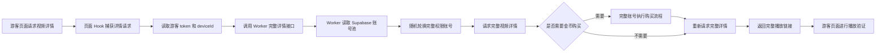

# 糖心志者

「糖心志者」是面向授权 CTF 隔离靶场的 Chrome MV3 安全测试插件，用于在当前浏览器会话中验证账号展示覆盖、完整账号池、完整播放链路、权限接口命中和远程账号池同步。

## 项目介绍

本插件默认以可拖动悬浮球显示，点击后在屏幕居中展开功能面板，可辅助测试游客账号侧的会员、尤物圈、余额展示，以及完整账号池驱动的视频播放链路验证。

## 环境要求

- 操作系统：Windows 10 或 Windows 11
- 浏览器：Chrome 120.0 及以上，或 Edge 120.0 及以上
- 插件规范：Chrome Manifest V3
- 本地检查工具：Node.js 22.16.0 及以上
- 远程账号池：Cloudflare Worker，Wrangler 4.98.0，Supabase 托管数据库
- 文件编码：全部使用 UTF-8

## 核心功能

- 悬浮球入口：默认显示「志」字悬浮球，支持 PC 和移动端拖动。
- 居中面板：点击悬浮球后隐藏悬浮球，面板在屏幕中间展开；关闭后悬浮球重新出现，手机端顶部栏固定可见。
- 展示覆盖：在沙箱页面侧展示为永久会员、永久尤物圈、999 余额。
- 链路观测：分类记录 M3U8、MP4、切片、播放接口、购买接口、支付接口、余额接口、权限接口和完整播放命中。
- 流程图日志：运行状态按步骤展示，避免出现代码式日志。
- 账号池模式：支持云端随机轮换、本地选中账号、云端优先本地兜底。
- 远程同步：通过 Cloudflare Worker 读取 Supabase 账号池，避免完整账号密码直接暴露在插件前端。
- 自动切换：云端账号出现异常时，由 Worker 侧尝试轮换下一个可用账号。
- 数据清理：覆盖安装新版本后，可一键清除旧版本残留的插件本地数据和页面运行缓存。
- CDP 状态读取：面板状态会写入 `#txzz-panel[data-txzz-state]`，方便自动化测试实时读取。

## 项目目录结构

```text
tangxin-zhizhe-extension/
├── manifest.json       # Chrome MV3 插件清单
├── background.js       # 后台服务，负责账号池、远程 Worker、完整详情获取
├── content.js          # 页面面板、悬浮球、链路记录、展示覆盖控制
├── content.css         # 面板、移动端、悬浮球和流程图样式
├── display_patch.js    # 页面主世界展示覆盖逻辑
├── nav_guard.js        # 页面导航守卫，降低视频页无感刷新问题
├── page_hook.js        # 页面主世界请求 Hook 与播放链路替换逻辑
├── page_probe.js       # 页面会话与用户信息探测脚本
└── README.md           # 插件使用文档
```

## 安装部署教程

1. 打开 Chrome 或 Edge。
2. 在地址栏输入 `chrome://extensions/` 并回车。
3. 打开右上角「开发者模式」。
4. 点击「加载已解压的扩展程序」。
5. 选择本目录：`tangxin-zhizhe-extension`。
6. 打开授权靶场页面 `https://txh068.com/`。
7. 页面右下角出现「志」字悬浮球，表示插件已加载。

## 远程账号池配置

推荐默认使用远程账号池。完整权限账号、Supabase `service_role`、目标接口密钥等敏感信息应放在 Cloudflare Worker Secrets 中，插件前端只保存 Worker 地址和 Client Token。

默认 Worker 地址：

```text
https://txzz-secure-pool.3199912548.workers.dev
```

插件面板配置步骤：

1. 点击「志」字悬浮球打开面板。
2. 进入「账号池」页。
3. `Worker URL` 填写 Cloudflare Worker 默认 `workers.dev` 地址，不建议继续使用未确认绑定状态的自定义域名。
4. `Client Token` 日常可以留空，插件已内置默认值；需要覆盖时再填写。
5. `Admin Token` 只在本地账号上传云端时填写，平时留空。
6. 「账号来源」可选择「云端随机轮换」「固定云端账号」「本地选中账号」「云端优先，本地兜底」。
7. 如果选择「固定云端账号」，在「固定云端账号」下拉框里选择要固定使用的云端账号。
8. 点击「保存远程配置」。
9. 点击「同步远程」读取云端账号池。

完整账号种子不应写入插件源码，建议通过 Worker Secret `TXZZ_SEED_ACCOUNTS_JSON` 写入，示例格式如下：

```json
[
  {
    "id": "full-lsyhook",
    "label": "lsyhook 完整权限",
    "username": "lsyhook",
    "password": "请填写完整权限测试账号密码",
    "notes": "授权 CTF 靶场完整权限账号"
  }
]
```

## 使用教程

### 场景一：应用展示覆盖

1. 打开靶场页面。
2. 点击悬浮球。
3. 点击「应用展示覆盖」。
4. 面板「账号状态」会显示永久会员、永久尤物圈、999 余额。
5. 进入「我的」或「尤物圈」页面，检查页面展示是否同步更新。

### 场景二：查看播放链路

1. 打开任意视频详情页。
2. 面板会自动记录播放接口、媒体源和完整播放命中。
3. 进入「链路」页查看捕获到的 M3U8、MP4、切片和播放接口。
4. 点击「复制最新播放链接」复制最近一次命中的播放链接。

### 场景三：使用本地账号池

1. 进入「账号池」页。
2. 填写账号 ID、显示名称、用户名、密码或 token/deviceId。
3. 点击「保存/更新账号」。
4. 选择「本地选中账号」。
5. 点击「验证选中账号」确认本地账号可用。

### 场景四：上传账号到云端

1. 进入「账号池」页。
2. 填写本地账号信息。
3. 在 `Admin Token` 中填写 Worker 管理 token。
4. 点击「上传当前表单账号」。
5. 点击「同步远程」确认云端账号池已更新。

### 场景四点五：固定使用某个云端账号

1. 进入「账号池」页。
2. 点击「同步远程」，确认云端账号已经出现在完整权限账号池。
3. 将「账号来源」切换为「固定云端账号」。
4. 在「固定云端账号」下拉框中选择目标账号，例如 `full-qr-757891a471f4`。
5. 点击「保存远程配置」。
6. 后续完整播放请求会把该账号 ID 发送给 Worker；Worker 新版本会固定使用该账号。若不是固定模式，Worker 会优先尝试选中账号，失败后继续轮换其他云端账号。

### 场景五：覆盖安装后清除旧数据缓存

1. 覆盖安装新版本插件后，打开靶场页面。
2. 点击「志」字悬浮球打开面板。
3. 进入「工具」页。
4. 点击「清除数据缓存」。
5. 在确认框中点击确定。
6. 插件会清除旧账号池、旧远程配置、旧完整详情、保存链路、页面 Hook 运行缓存，并恢复当前版本默认账号池。
7. 刷新当前页面后继续运行验证。

## 流程图



## 本地验证

在仓库根目录运行：

```powershell
node --check .\tangxin-zhizhe-extension\background.js
node --check .\tangxin-zhizhe-extension\content.js
node --check .\tangxin-zhizhe-extension\page_hook.js
node --check .\verify_txzz_clear_cache.js
node --check .\verify_txzz_mobile_ball.js
node -e "JSON.parse(require('fs').readFileSync('.\\tangxin-zhizhe-extension\\manifest.json','utf8')); console.log('manifest ok')"
```

CDP 回归脚本：

```powershell
node .\verify_txzz_extension.js
```

浏览器加载插件诊断：

```powershell
node .\diagnose_chrome_smoke.js
node .\diagnose_chrome_extension_load.js
```

覆盖安装数据清理验证：

```powershell
node .\verify_txzz_clear_cache.js
```

成功时会输出 `ok: true`，并在 `evidence\txzz_clear_cache_时间戳\result.json` 中保存清理前后的账号池、完整详情缓存和远程配置对比结果。

手机端交互验证：

```powershell
$env:TXZZ_VERIFY_DARK="0"
node .\verify_txzz_mobile_ball.js
```

成功时会输出 `ok: true`，并验证手机模式下悬浮球触摸展开、顶部关闭按钮触摸关闭、关闭后悬浮球恢复、再次展开、内部滚动回顶和导航标签点击。

真实隔离靶场验证脚本：

```powershell
$env:TXZZ_TARGET_URL="https://txh068.com/movie/detail/35289"
$env:TXZZ_MOVIE_ID="35289"
$env:TXZZ_KEEP_BROWSER="1"
node .\verify_txzz_cdp_live.js
```

如果遇到验证码，不要反复刷新页面；人工通过后继续测试即可。

## 常见问题排查

### 页面没有出现悬浮球

1. 确认插件已经在 `chrome://extensions/` 启用。
2. 确认当前页面地址匹配 `manifest.json` 中的授权域名。
3. 刷新页面后再看右下角是否出现「志」字悬浮球。
4. 如果是 CDP 自动化打开浏览器，请优先使用内置 Chrome `C:\Users\lanshiy\.agent-browser\browsers\chrome-148.0.7778.167\chrome.exe`。
5. 内置 Chrome 和 Playwright Chromium 启动时必须带 `--no-sandbox`，否则会提前退出，常见现象是退出码 `3`。
6. 不建议用系统 Chrome 149 做 `--load-extension` 自动加载验证；它可以开 CDP，但不会稳定加载未打包扩展。

### CDP 诊断显示系统 Chrome 加载失败

这是预期现象。`diagnose_chrome_extension_load.js` 会同时测试系统 Chrome 和内置 Chrome：系统 Chrome 149 可能显示 `txzzPanel: false`，内置 Chrome 148 应显示 `txzzPanel: true`。只要内置 Chrome 148 通过，就说明自动化验证环境正常。

### 手机模式点击悬浮球没有反应

1. 确认已安装最新版本插件。
2. 在开发者工具中切换移动端后刷新页面。
3. 悬浮球使用 `pointer` 事件，正常应支持鼠标和触屏点击。

### 手机模式顶部按钮点击无效或滚动后顶部栏显示不完整

1. 确认插件版本为 `1.1.2` 或更高版本。
2. 新版本手机端面板会固定在当前可视窗口内，浏览器地址栏收起或展开后会自动重算面板高度。
3. 顶部关闭按钮为独立关闭动作，不再依赖整条顶部栏拖动。
4. 面板内容在插件内部滚动，顶部栏固定可见，标签导航在滚动时吸顶。
5. 可运行 `node .\verify_txzz_mobile_ball.js` 进行手机模式触摸验证。

### 面板里出现乱码或裸露标签

1. 确认源码文件是 UTF-8 编码。
2. 重新加载扩展。
3. 运行 `node --check .\tangxin-zhizhe-extension\content.js` 检查脚本语法。
4. 运行乱码扫描，确认没有中文乱码片段和破损闭合标签残留。

### 远程账号池同步失败

1. 访问 Worker 健康检查接口，确认 Worker 可用。
2. 确认 Cloudflare Worker Secrets 已配置 `SUPABASE_URL`、`SUPABASE_SERVICE_ROLE_KEY`、`TXZZ_CLIENT_TOKEN`。
3. 上传账号时还需要配置 `TXZZ_ADMIN_TOKEN`。
4. 如果 Supabase 表不存在，先执行 `txzz-worker/schema.sql`。
5. 如果插件显示 `Missing Worker secret/env: SUPABASE_URL`，说明线上 Worker 没有配置或没有成功注入 `SUPABASE_URL`，此时同步会失败，账号池不会出现云端账号。
6. 同步失败时，插件会在「远程账号池」提示区和流程日志里显示具体错误，不再静默显示为空。

### 无法获取完整播放链接

1. 先测试 Worker 的 `/v1/accounts`，如果返回缺少 `SUPABASE_URL`，说明 Cloudflare Worker Secrets 还没有配置完成。
2. 确认账号池里至少有一个启用的完整权限账号。
3. 云端不可用时，可把账号来源切到「本地选中账号」，或使用「云端优先，本地兜底」。
4. 插件会自动把 `play_url`、`m3u8_url`、`video_url` 等常见字段归一化为 `play_link`，如果仍为空，说明完整账号请求到的详情本身没有可播放字段。
5. 「完整播放」页会显示最近一次命中的 `movieId`、账号、动作和播放链接；如果详情成功但没有链接，会在流程日志里明确显示。

### 覆盖安装后仍然读取到旧账号或旧播放详情

插件版本 `1.1.4` 起会在首次读取后台状态时自动清理旧版本缓存：旧 Worker 地址、旧云端账号摘要、完整详情缓存、保存链路和页面 Hook 运行缓存会自动重置为当前版本默认状态。用户手动导入的本地账号会尽量保留。若页面仍显示旧状态，可进入插件「工具」页点击「清除数据缓存」做手动兜底。

### 视频页反复刷新

1. 确认 `nav_guard.js` 已被加载。
2. 使用已经通过验证码的同一个浏览器会话继续测试。
3. 避免在验证码出现时连续刷新。

## 开源前检查

- 不要提交 `.dev.vars`。
- 不要提交浏览器 profile、截图、CDP 输出和 `evidence/` 中的敏感记录。
- 不要在 README 中写入完整权限账号明文密码。
- 已经出现在聊天、日志或截图中的密钥应及时轮换。
- 公开仓库建议默认使用远程账号池，减少前端本地敏感信息。

## 边界说明

本项目只用于竞赛方控制的授权 CTF 隔离靶场，不用于真实支付绕过、非授权站点、非授权账号或第三方权益访问。

## 更新日志

2026-06-09 03:12 【修复】修复 CDP 浏览器加载插件失败问题，验证脚本统一补齐 `--no-sandbox`、CDP 地址参数和未打包插件加载参数，内置 Chrome 148 已验证可正常注入悬浮球。
2026-06-09 03:12 【优化】优化完整播放请求兜底逻辑，页面 `$request` 不存在时自动通过内容脚本和后台账号池获取完整详情，减少新版页面运行时差异导致的失败。
2026-06-09 01:34 【优化】增强完整播放链路获取逻辑，延长完整详情等待时间，兼容多种播放链接字段，并在云端失败时支持本地账号兜底。
2026-06-09 01:22 【修复】修复 README 编码损坏问题，重建完整中文插件文档，同步说明远程账号池、悬浮球交互、播放链路和常见问题排查。
2026-06-09 09:06 【新增】新增「清除数据缓存」功能，覆盖安装新版本后可一键清理旧账号池、旧远程配置、旧完整详情、保存链路和页面 Hook 运行缓存，并同步补充使用教程、常见问题和验证命令。
2026-06-09 09:18 【修复】修复手机版顶部关闭、刷新和导航按钮触摸点击不稳定的问题，手机端面板改为可视窗口固定布局，顶部栏常驻，标签导航吸顶，滚动到底后可正常回到完整顶部栏。
2026-06-09 16:21 【修复】修复云端同步失败时账号池没有错误提示的问题，新增「固定云端账号」模式和固定账号下拉选择；完整播放请求在非固定模式下不再把旧账号 ID 强行锁死，Worker 可在旧账号失败后继续轮换其他云端账号。
2026-06-09 20:00 【优化】远程账号池配置说明改为优先使用 Cloudflare Worker 默认 `workers.dev` 域名，避免自定义域名未绑定到最新 Worker 时导致账号池同步失败。
2026-06-09 20:32 【修复】将插件默认远程 Worker 地址更新为已验证可用的 `workers.dev` 默认域名，健康检查显示运行时密钥全部注入成功，账号池可正常同步。
2026-06-09 20:42 【优化】新增覆盖安装后的自动缓存清理机制，插件首次读取状态时会自动切换到当前默认 Worker、清理旧云端账号摘要和完整播放缓存，同时保留用户手动导入的本地账号。
