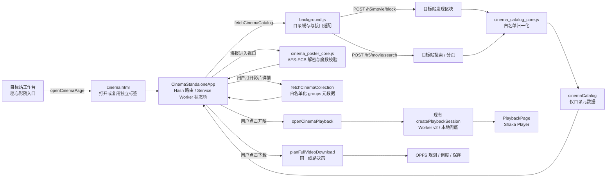

# 糖心影院应用与目录系统 5.8

## 目标

糖心影院是扩展 `5.8.0` 的独立沉浸式影视 App，运行于 `chrome-extension://<扩展 ID>/cinema.html` 浏览器标签页，不再作为目标网站工作台内部的覆盖层。目标站面板只保留今日总览、照料中心、账号小屋和影院入口；影院以自己的首页、发现、搜索、片库、书签、足迹、下载、存储、详情和播放路由承载完整观影体验。系统严格分离“浏览原始目录”和“取得完整媒体”：用户浏览时只需要标题、海报、分类与白名单化合集元数据；完整线路、账号轮换、金币安全与下载规划只有在用户明确点击开映或下载后才运行。

系统因此固定为两段式：

1. **目录阶段**：读取目标站原始列表元数据，展示发现、搜索、筛选和分页结果。
2. **消费阶段**：用户点击开映或下载后，复用现有完整播放会话、线路决策和 OPFS 下载规划器。

这条边界既减少无意义请求，也保证在海报墙停留、搜索或快速切换详情时不会产生后台购买行为。

## 5.8 视觉与交互系统

- `ui-src/styles/cinema/` 是影院唯一视觉来源，按令牌、壳层、目录、收藏、运营页、播放器和动效拆分；Vite 生成的同一份 CSS 同时服务独立页和 Shadow DOM。
- 桌面采用专业影视侧栏、顶栏、主视觉轮播与横向片单；窄屏切换为五项底栏，详情标题、海报、操作和合集选集按可见高度重新分配。
- 页面使用珊瑚红、奶油黄、薄荷绿和克制淡紫作为可爱点缀，主体保持高对比深色；焦点、减少动态效果、安全区与内部滚动均有明确契约。
- 每次路由切换会重置影院主滚动区，避免详情页滚动位置污染移动播放舞台或播放器设置菜单。

## 数据流



## 目标站目录契约

### 发现页

```text
POST /h5/movie/block
data: { position: "app_home_tj" }
```

有效区块使用 `id / name / style / filter / items`。无区块编号、负数 `style`、没有有效影片的广告或装饰区块会被直接丢弃。

### 搜索与分页

```text
POST /h5/movie/search
```

请求参数只允许：

- `keywords`
- `order`
- `pay_type`
- `canvas`
- `tag_id`
- `cat_id`
- `position`
- `page`
- `page_size`

`page_size` 固定限制为 `1～48`。未知字段、token、播放地址或调用方自带的任意额外参数不会向上游传递。

### 合集与分集

用户打开影片详情后，详情响应中的 `groups / list / items` 经过同一字段白名单归一化为 `CinemaCollectionState`。之所以对每个被打开的影片执行检测，是因为部分上游目录项缺少 `is_episode` 标记；普通影片只得到单个父项且不显示选集，真正合集才显示多集。最多保留 120 集，并始终保留当前父集；刷新失败时保留上一次可用选集，不用空错误覆盖内容。合集检测只保留分集编号、标题、封面、时长、权益和顺序，原始响应中的线路字段会被重建过程丢弃，也不会触发购买。

在详情页选择分集会替换当前详情栈顶，而不是不断追加返回历史；播放器内选择分集则重新调用 `openCinemaPlayback`，禁止沿用上一集的签名 URL。

## 目录字段白名单

`cinema_catalog_core.js` 使用显式字段构造 `CinemaMovie`：

- 影片编号和标题
- 海报、创作者与头像
- 时长、画面方向
- 免费 / VIP / 金币类型和金币价格
- 是否为合集，以及归一化后的合集分集关系
- 浏览、喜欢、收藏、评分、发布时间和普通徽标

不会从原始对象展开未知字段。下列内容不会进入 `cinemaCatalog`：

- `play_link`
- `backup_link`
- `play_url`
- `m3u8`
- `media_url`
- `signed_url`
- 任意嵌套完整播放地址

海报和头像只接受 `http:` 或 `https:` URL；相对路径统一解析到目标站域名。

## 状态与请求代次

目录状态保存在 `txzzState.cinemaCatalog`。合集是当前标签页的短期视图状态，由后台有限内存缓存协助恢复，不写入高频 `txzzState`；独立页合并下载进度或片库状态时会显式保留正在查看的合集和下载规划弹层：

```ts
type CinemaCatalogState = {
  schemaVersion: 1;
  mode: "discover" | "browse" | "search";
  phase: "idle" | "loading" | "loading-more" | "ready" | "error";
  requestId: string;
  query: string;
  queryKey: string;
  filters: Record<string, string>;
  sections: CinemaSection[];
  items: CinemaMovie[];
  page: number;
  pageSize: number;
  hasMore: boolean;
  fetchedAt: string;
  error: string;
};

type CinemaCollectionState = {
  phase: "idle" | "loading" | "ready" | "error";
  requestId: string;
  parentMovieId: string;
  title: string;
  items: CinemaMovie[];
  fetchedAt: string;
  error: string;
};
```

每次发现、搜索、筛选或分页都创建新 `requestId`。后台和内容脚本分别保存最新代次；旧响应可以正常结束网络请求，但不能覆盖新查询。

相同查询的单页结果缓存 5 分钟，最多保留 20 个查询页，按最近使用顺序淘汰。内存副本同步到 `chrome.storage.session`，因此 Service Worker 休眠或重启后仍可恢复；浏览器会话结束后自动清空。持久快照设有约 3.5 MB 预算，达到预算时只保留最近查询。缓存不包含账号凭据或播放 URL，载入时还会再次拒绝任何疑似播放字段。

## 加密海报链路

目标站目录返回的海报通常以 `.bnc?ext=.jpg` 形式存在，浏览器不能直接交给 ``。网站正式脚本的解码契约已经用真实密文验证为：

- `CryptoJS.enc.Utf8.parse("525202f9149e061d")`
- `CryptoJS.AES.decrypt(...)`
- `CryptoJS.mode.ECB`
- 默认 `PKCS7` 填充

`cinema_poster_core.js` 使用 Web Crypto 的 AES-CBC 单块构造实现等价 ECB 解密，随后严格检查 PKCS7 和 JPEG、PNG、GIF、WebP 魔数。后台 `fetchCinemaPoster` 还会强制执行：

1. `movieId + posterUrl` 必须与当前 `cinemaCatalog`、独立 `txzzExperienceV1` 片库或已验证合集中的影片精确匹配，不能充当任意 URL 代理。
2. 只接受公开网络主机上的 HTTPS `.bnc` 地址和受支持的输出扩展名，拒绝 localhost、内网 IPv4、整数/八进制 IPv4、链路本地、IPv4 映射和 IPv6 字面量；网络层禁止重定向。
3. 密文不能超过 6 MiB，网络请求 12 秒超时。
4. 解密结果只保存在后台与 React 的有限 LRU 内存缓存中，绝不写入 `txzzState`、收藏或目录缓存。
5. 海报卡片使用 `IntersectionObserver` 提前 360 像素加载；Hero 和已打开的详情弹层立即加载。

真实样本验证：密文 `122544` 字节解密为 `122538` 字节 JPEG，文件头为 `FF D8 FF E0 00 10 4A 46 49 46`，文件尾为 `FF D9`。实现只执行一次 Web Crypto CBC 解密，再按前一密文块线性异或还原 ECB，时间与内存复制复杂度保持 O(n)。

## 开映与下载边界

影院详情页、合集当前集和播放器内选集都是明确的开映入口。点击后：

1. 内容脚本创建 `cinema_playback_<timestamp>` 请求编号。
2. 后台强制生成 `cinema:<movieId>:<requestId>` 上下文键。
3. 请求不读取网页 `pageEpoch`，也不要求影片编号与当前 Vlog 活动卡片一致。
4. 复用 `createPlaybackSession`、`finishPlaybackSession` 和原有购买幂等保护。
5. React 立即切到放映室，显示现有可见检票步骤。
6. 资源完成后保持暂停，用户仍需点击播放器的播放按钮。

影院详情、合集当前集、播放器画面、影片侧栏与下载抽屉都可以发起下载。所有入口只发送 `movieId / movieTitle / sourceId` 等规划参数，统一进入 `planFullVideoDownload`：先显示可见探测态，再确认完整线路、清晰度、容器、清单兼容性与空间，最后由用户决定是否放入现有可恢复队列。探测失败保留明确错误和重新探测入口，不创建第二套下载器。

海报墙、发现和搜索抓取只允许 `/movie/block` 与 `/movie/search`。用户打开详情后允许调用 `/movie/detail`，但只经 `normalizeCollectionResponse` 重建分集白名单对象，禁止保存或返回任何播放字段；目录与合集路径都没有账号池轮换、`/movie/doBuy` 或 Worker `/v2/playback/session` 调用。代码审查时应继续保持这一物理边界；只有明确的开映或下载手势可以跨越它。

## 界面结构

- **独立 App 壳层**：后台使用 `runtime.getContexts` 识别浏览器恢复或直接打开的 `cinema.html`，重复入口聚焦并复用同一标签；桌面使用可折叠影院侧栏，移动使用六项安全区底栏，普通工作台页面和影院路由互不覆盖。
- **Featured Hero**：使用本期第一部影片呈现深色影院主视觉和明确详情/开映动作。
- **发现分区**：按目标站有效区块生成横向海报带，区块过滤器可进入完整分页浏览。
- **搜索与筛选**：支持关键词与最新、热门、免费、VIP、竖屏、横屏组合查询；清空关键词会保留当前筛选，点击「发现」才显式重置。
- **影片详情**：展示原始目录字段、收藏、稍后看、直接下载和目录/媒体分离说明。
- **合集选集**：详情页显示封面、序号、时长和权益；画面内选集重新检票。免费/VIP 下一集自然结束后倒计时 5 秒续播，金币下一集必须再次确认。
- **滚动记忆**：首页、发现、片库、足迹和详情分别恢复浏览位置；合集切集复用同一详情滚动上下文。
- **移动导航**：六项底栏保持 44 像素图标热区，320 像素宽度使用紧凑文字。
- **生产样式单一来源**：网站工作台与独立影院加载相同 `dist-ui/txzz-ui.css`；独立页覆盖块固定放在源码末尾，防止历史影院选择器覆盖背景、分隔线、动画和断点。
- **减少动态效果**：系统启用 `prefers-reduced-motion` 后停止 Hero 揭幕、星光闪烁和海报缩放动画。

## 开源架构参考与许可证边界

- [Harbor](https://github.com/harborstremio/harbor)（MIT）：参考 Hero、媒体 Rails、详情层级、滚动位置记忆和流排序思想。
- [Jellyfin Web](https://github.com/jellyfin/jellyfin-web)（GPL-2.0）与 [Stremio Web](https://github.com/Stremio/stremio-web)（GPLv2）：只参考首页/发现/详情/片库的信息架构。
- [Vidstack](https://github.com/vidstack/player)（MIT）：调研其播放器组合模式，但当前仍保持单一 Shaka 内核与自有 React 控制层。

仓库没有复制 GPL/AGPL 项目的源代码、样式或资源；影院继续使用本项目 React + TypeScript + Shaka 架构。引用只用于说明公开的信息架构参考。

## 测试与验收

纯核心测试覆盖：

- 广告和负样式区块过滤
- 无编号影片过滤
- 跨区块、跨分页去重
- 时长、权益和横竖屏归一化
- 搜索参数白名单与分页限制
- 空页终止
- 完整播放字段不进入目录对象
- AES-128-ECB/PKCS7 海报解密和图片魔数校验
- 搜索关键词与筛选组合、显式重置
- 合集字段白名单、当前父集保留、最多 120 集与失败保留旧选集
- 画面选集代次、免费/VIP 自动续播、金币确认和旧媒体 `ended` 隔离
- 影院详情、播放器与侧栏下载入口，以及探测中/失败/就绪三态

正式发布还必须在安装后的 Chrome 开发版扩展中检查：

1. 发现页真实返回区块和海报。
2. 搜索请求只命中 `/h5/movie/search`。
3. 海报墙、发现和搜索阶段没有 `/movie/detail`、`/movie/doBuy` 或 `/v2/playback/session`；打开详情只允许一次白名单化 `/movie/detail` 合集检测，仍不得出现购买或完整会话请求。
4. 快速连续搜索时旧结果不覆盖最新关键词。
5. 点击开映后进入放映室，并只为所选影片创建完整会话。
6. 合集可在详情和播放器内切集；免费/VIP 下一集续播，金币下一集等待确认。
7. 点击详情或播放器下载立即显示探测进度，规划完成后可选择线路、清晰度、容器、优先级和开始时间。
8. `1440×900`、`390×844`、`844×390` 和 `320 / 640 / 1024 / 1536` 像素宽度下导航、详情、海报墙、选集和下载规划器均可操作。
9. 全新配置的空 `bootstrapSession` 可创建访客会话；片库合集/海报从 `txzzExperienceV1` 识别；新筛选或搜索加载时不短暂展示上一查询片单。
10. 影院页直接打开、浏览器恢复和重复点击入口三种路径都只保留一个影院标签。

## 更新日志

[2026-07-30 01:38] 新增独立糖心影院目录、字段白名单、目标站发现/搜索适配、5 分钟查询缓存、旧响应隔离与按需开映链路。
[2026-07-30 02:40] 新增加密海报后台解密、严格目录归属和图片格式校验、视口懒加载、会话级查询缓存恢复、组合筛选与非阻塞错误提示。
[2026-07-30 02:55] 海报解密改为单次 CBC 解密与线性异或还原 ECB，并禁止重定向；目录网络计划固定为 block/search 两个只读端点，补齐播放字段注入测试与独立 pack 完整门禁。
[2026-07-30 11:22] 扩展 5.5.0 将目录升级为独立影视 App，增加合集归一化、详情/画面选集、免费/VIP 自动续播、金币确认、滚动记忆和全链路下载入口；目录与合集仍严格排除播放 URL。
[2026-07-30 21:36] 扩展 5.6.0 将影院迁移到独立 `cinema.html` 标签页，增加标签复用、六项主导航、直接 Service Worker 状态桥和生产样式单一来源；真实 Chrome DevTools 验收修复空访客会话、独立片库校验、无目录标记合集识别和查询旧内容闪回。
[2026-07-30 21:36] 扩展 5.6.0 补齐独立影院外部 Hash 与浏览器前进/后退同步，修复同一标签地址变化但界面仍停留旧路由的问题；真实 Chrome Dev 验证 9:16 影片在 `390×844` 与 `844×390` 中完整收纳，播放器设置可独立滚动，页面无横向溢出或文字裁切。
[2026-07-31 01:45] 扩展 5.7.0 把全部影院业务收口到独立标签页，并以首页、发现、搜索、片库、书签、足迹、下载、存储、详情和放映十类视图重构为专业影视 App；请求代次、路由、状态桥与 ViewModel 分层，下载规划票据和错误留场使用单一契约。
[2026-07-31 01:45] 扩展 5.7.0 调整移动端主视觉的信息密度：长标题最多三行，字号随视口限制在约 22～32 像素，并为简介、双操作按钮和右侧海报保留独立空间。
[2026-07-31 01:53] 扩展 5.7.1 根据真实矮横屏回归结果扣除顶栏与固定底部导航高度，隐藏重复小海报并压缩标题、元数据和按钮间距，保证 `844×390` 下操作区完整可见。
