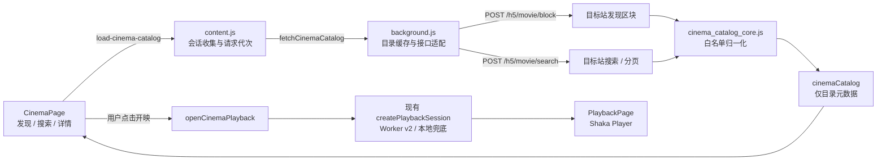

# 糖心影院目录系统

## 目标

糖心影院是扩展 `5.4.0` 新增的独立资源目录。它解决两个不同阶段被混在一起的问题：用户浏览片单时只需要标题、海报和分类；完整线路、账号轮换与金币安全流程只有在用户明确选择影片后才需要运行。

系统因此固定为两段式：

1. **目录阶段**：读取目标站原始列表元数据，展示发现、搜索、筛选和分页结果。
2. **开映阶段**：用户点击「获取完整线路并开映」后，复用现有完整播放会话和放映室。

这条边界既减少无意义请求，也保证在海报墙停留、搜索或快速切换详情时不会产生后台购买行为。

## 数据流



## 目标站目录契约

### 发现页

```text
POST /h5/movie/block
data: { position: "app_home_tj" }
```

有效区块使用 `id / name / style / filter / items`。无区块编号、负数 `style`、没有有效影片的广告或装饰区块会被直接丢弃。

### 搜索与分页

```text
POST /h5/movie/search
```

请求参数只允许：

- `keywords`
- `order`
- `pay_type`
- `canvas`
- `tag_id`
- `cat_id`
- `position`
- `page`
- `page_size`

`page_size` 固定限制为 `1～48`。未知字段、token、播放地址或调用方自带的任意额外参数不会向上游传递。

## 目录字段白名单

`cinema_catalog_core.js` 使用显式字段构造 `CinemaMovie`：

- 影片编号和标题
- 海报、创作者与头像
- 时长、画面方向
- 免费 / VIP / 金币类型和金币价格
- 浏览、喜欢、收藏、评分、发布时间和普通徽标

不会从原始对象展开未知字段。下列内容不会进入 `cinemaCatalog`：

- `play_link`
- `backup_link`
- `play_url`
- `m3u8`
- `media_url`
- `signed_url`
- 任意嵌套完整播放地址

海报和头像只接受 `http:` 或 `https:` URL；相对路径统一解析到目标站域名。

## 状态与请求代次

目录状态保存在 `txzzState.cinemaCatalog`：

```ts
type CinemaCatalogState = {
  schemaVersion: 1;
  mode: "discover" | "browse" | "search";
  phase: "idle" | "loading" | "loading-more" | "ready" | "error";
  requestId: string;
  query: string;
  queryKey: string;
  filters: Record<string, string>;
  sections: CinemaSection[];
  items: CinemaMovie[];
  page: number;
  pageSize: number;
  hasMore: boolean;
  fetchedAt: string;
  error: string;
};
```

每次发现、搜索、筛选或分页都创建新 `requestId`。后台和内容脚本分别保存最新代次；旧响应可以正常结束网络请求，但不能覆盖新查询。

相同查询的单页结果在 Service Worker 内存中缓存 5 分钟，最多保留 20 个查询页，按最近使用顺序淘汰。缓存不包含账号凭据或播放 URL，Service Worker 重启后自然清空。

## 开映边界

影院详情页的主按钮是唯一新增开映入口。点击后：

1. 内容脚本创建 `cinema_playback_<timestamp>` 请求编号。
2. 后台强制生成 `cinema:<movieId>:<requestId>` 上下文键。
3. 请求不读取网页 `pageEpoch`，也不要求影片编号与当前 Vlog 活动卡片一致。
4. 复用 `createPlaybackSession`、`finishPlaybackSession` 和原有购买幂等保护。
5. React 立即切到放映室，显示现有可见检票步骤。
6. 资源完成后保持暂停，用户仍需点击播放器的播放按钮。

目录抓取函数中没有账号池轮换、`/movie/detail`、`/movie/doBuy` 或 Worker `/v2/playback/session` 调用。代码审查时应继续保持这一物理边界。

## 界面结构

- **Featured Hero**：使用本期第一部影片呈现深色影院主视觉和明确开映动作。
- **发现分区**：按目标站有效区块生成横向海报带，区块过滤器可进入完整分页浏览。
- **搜索与筛选**：支持关键词、最新、热门、免费、VIP、竖屏和横屏。
- **影片详情**：展示原始目录字段、收藏、稍后看和目录/播放分离说明。
- **移动导航**：六项底栏保持 44 像素图标热区，320 像素宽度使用紧凑文字。
- **减少动态效果**：系统启用 `prefers-reduced-motion` 后停止 Hero 揭幕、星光闪烁和海报缩放动画。

## 测试与验收

纯核心测试覆盖：

- 广告和负样式区块过滤
- 无编号影片过滤
- 跨区块、跨分页去重
- 时长、权益和横竖屏归一化
- 搜索参数白名单与分页限制
- 空页终止
- 完整播放字段不进入目录对象

正式发布还必须在安装后的 Chrome 开发版扩展中检查：

1. 发现页真实返回区块和海报。
2. 搜索请求只命中 `/h5/movie/search`。
3. 浏览目录时没有 `/movie/detail`、`/movie/doBuy` 或 `/v2/playback/session`。
4. 快速连续搜索时旧结果不覆盖最新关键词。
5. 点击开映后进入放映室，并只为所选影片创建完整会话。
6. `1440×900`、`390×844`、`844×390` 和 `320` 像素宽度下导航、详情弹层和海报墙均可操作。

## 更新日志

[2026-07-30 01:38] 新增独立糖心影院目录、字段白名单、目标站发现/搜索适配、5 分钟查询缓存、旧响应隔离与按需开映链路。
